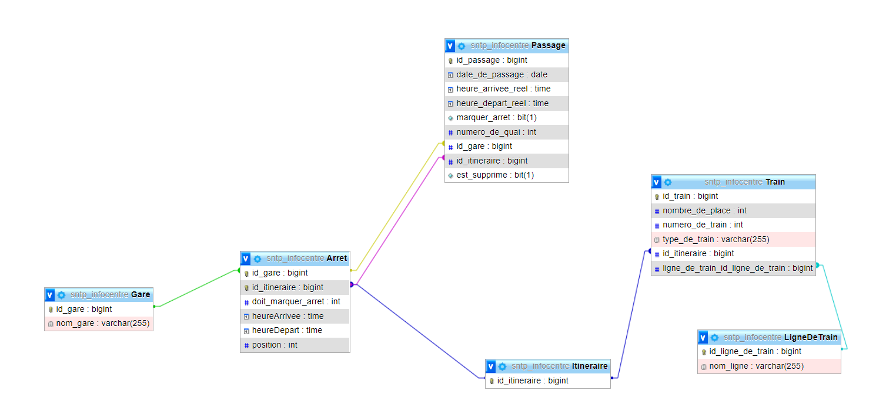
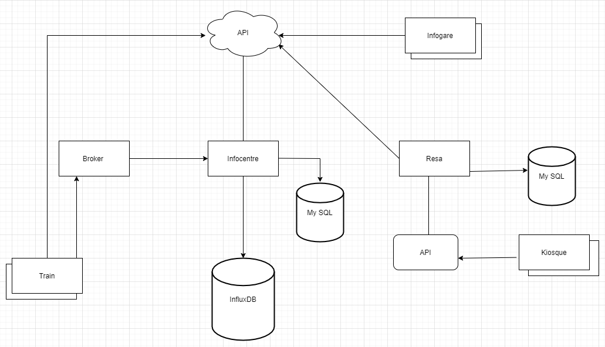
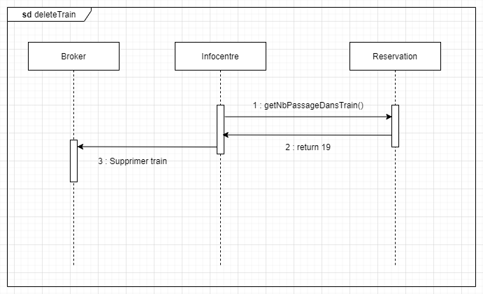
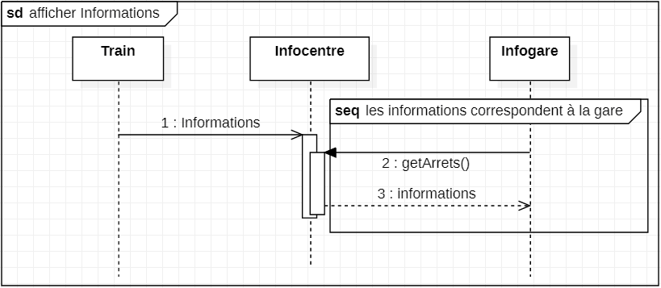

# Projet SNTP

## Sonarqube

## 1. Système à modéliser

Système de gestion de réservation de billet de train , gestion de la circulation des train.

### Description du Système

___
On souhaite modéliser les échanges internes et externes entre les trains, l'infocentre ainsi que l'ensemble des
voyageurs sans distinction.

L’infocentre est le composant central du système d’information voyageur de la SNCF. Son rôle est d’accéder aux données
concernant les trains, puis de faire remonter différentes informations, à savoir l'heure de départ, l'heure d'arrivée,
le trajet, les éventuels retards...via le déploiement d’une API.

La position des trains pourrait être envoyée en point to point toutes les X secondes

Les retards et perturbations peuvent être involontaires et causés par des facteurs externes, ou parfois voulus par
l’infocentre. L’infocentre décidera de perturber volontairement le trafique ferroviaire en s’appuyant sur des règles
métiers bien précises.

Les clients peuvent recevoir les informations remontées par l’infocentre via différents canaux : Infogare, système
d’information voyageur embarqué, applications mobiles, mails etc…

Les Infogares sont des écrans d’affichage d’informations concernant les départs, arrivées et perturbations des trains.
Ils affichent également des informations ayant un impact majeur sur le réseau aux voyageurs.

L’infocentre gèrera tout ce qui concerne les horaires de trains et éventuels retards cependant il ne s’occupera pas des
informations purement locales à chaque arret telles que l’accueil à l’embarquement, le numéro de voie du train ou la
localisation des voitures sur la voie. C’est le système d’informations de chaque arret qui s’en occupera.

### Règles métier

___

- Un TER pourra attendre un TGV, mais pas l’inverse
- Seul les TGV sont des trains à réservation
- On ne retardera le train que si le nombre de passagers ayant réservés en rupture de correspondance est > 50
- Un train desservira exceptionnellement une arret si elle est sur son trajet et que le train précédent a un retard de
  plus de 2h.
- En cas de retard de plus de 30min, un TGV ne desservira pas une arret si aucun passager n’a un billet de
  départ/arrivée de cette arret.

### Exigence du système

___

1. Les trains doivent transmettre leur position en méthode Publish-Subscribe
2. L'infocentre doit transmettre ses informations via une API
3. L'infocentre doit pouvoir, si les conditions le permettent, générer des retards pour un train
4. Lors d’un retard sur un train à réservation, les passagers concernés seront avertis par email
5. L'infocentre doit pouvoir, si les conditions le permettent, rajouter une station à un train
6. L'infocentre doit pouvoir, si les conditions le permettent, supprimer une station à un train
7. L'infocentre doit pouvoir, si les conditions le permettent, supprimer un train
8. Lorsqu’un train à réservation est supprimé, les passagers concernés seront avertis par email
9. L'infogare doit pouvoir afficher les informations qui concernent les départs, les arrivées et les retards
10. L'infogare doit personnaliser les informations en fonction de chaque arret
11. Les données remontées de l'infocentre doivent toujours être sous le même format
12. Les voyageurs doivent pouvoir acheter un billet de train
13. L’achat doit se faire au kiosque
14. Lors de l’achat du billet on doit pouvoir afficher les retards au voyageur
15. Un voyageur doit pouvoir échanger son billet au kiosque
16. Lors de l’échange il peut y avoir un changement de tarif
17. Si lors de l’échange le tarif est inférieur au tarif initial alors aucun remboursement ne sera fait
18. Le kiosque doit être connecté à la base de données nationale des kiosques

## 2. Schémas et Diagrammes de séquences

### Schéma de la base de données

___
Infocentre :

Reservation :

### Schéma du système

___

### Diagramme de classe

___
_Common_ :

_Infocentre_ :

_Réservation_ :

_Kiosque_ :

_Infogare_ :

_Train_ :

_Ensemble_ :

### Diagramme de séquence

___
*1. Les trains doivent transmettre leur position en méthode Point-To-Point*

*2. L'infocentre doit transmettre ses informations via une API *

*3. L'infocentre doit pouvoir, si les conditions le permettent, générer des retards pour un train*

*4. Lors d’un retard sur un train à réservation, les passagers concernés seront avertis par email*

*5. L'infocentre doit pouvoir, si les conditions le permettent, rajouter une station à un train*

*6. L'infocentre doit pouvoir, si les conditions le permettent, supprimer une station à un train*

*7. L'infocentre doit pouvoir, si les conditions le permettent, supprimer un train*

*8. Lorsqu’un train à réservation est supprimé, les passagers concernés seront avertis par email*
**CF schéma 4**

*9. & 10. L'infogare doit pouvoir afficher les informations qui concernent les départs, les arrivées et les retards*

*12. 13. & 14. Les voyageurs doivent pouvoir acheter un billet de train*

*15. 16. 17. Un voyageur doit pouvoir échanger son billet au kiosque*

*18. Le kiosque doit être connecté à la base de données nationale des kiosques*

